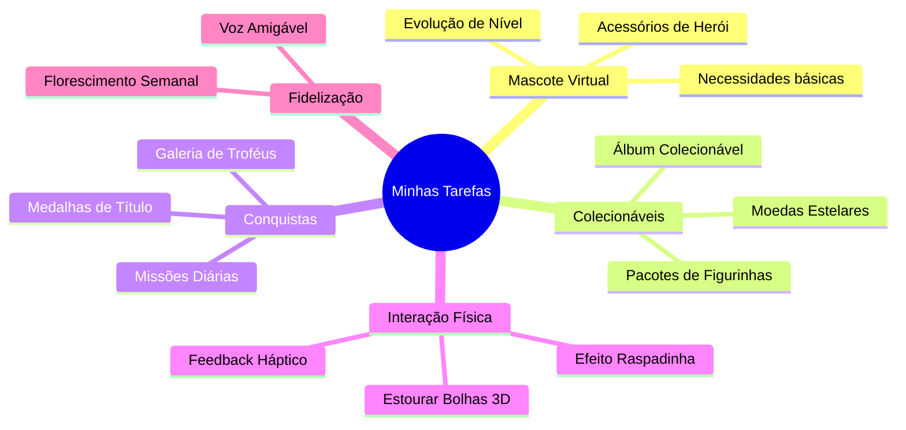

# Ideias de Gamificação e Engajamento Infantil 🦖🏆

Este documento reúne sugestões e mecânicas de gamificação para aumentar o interesse, engajamento e autonomia das crianças ao utilizar o aplicativo **"Minhas Tarefas do Dia! 🌟"**.

---

## 📂 Visão Geral das Propostas

---

## 🐣 1. Mascote Virtual ou Herói Evolutivo (Virtual Pet)

Transforma o cumprimento das obrigações diárias em um ato de cuidado e carinho com um pequeno companheiro virtual.

*   **Escolha Inicial**: A criança escolhe um pet (ex: Dragãozinho de Fogo, Gatinha Astronauta, Unicórnio Mágico) ou um avatar customizável.
*   **XP e Evolução**:
    *   Cada tarefa concluída concede **Moedas** e **XP (Pontos de Experiência)**.
    *   Com XP suficiente, o pet passa por fases de evolução (Ovo 🥚 ➔ Filhote 🍼 ➔ Jovem 🦖 ➔ Super Mascote 🐉).
*   **Personalização**:
    *   Possibilidade de comprar chapéus, óculos escuros, capas de herói e brinquedos virtuais para o pet usando as Moedas Estelares conquistadas no dia a dia.
*   **Diálogo**: O pet pode aparecer no topo do app mandando mensagens de incentivo ou pedindo para realizar tarefas específicas para brincar.

---

## 🦄 2. Álbum de Figurinhas Digital (Sticker Album)

Aproveita a paixão natural das crianças por coleções físicas e transfere essa satisfação para o universo digital.

*   **Economia de Recompensas**:
    *   Cada atividade concluída garante **Moedas Estelares** (ex: 5 moedas por tarefa comum, 10 por tarefas com timer longo).
*   **Loja de Pacotes**:
    *   Um "Pacotinho Comum" custa 15 moedas e contém 3 figurinhas aleatórias.
    *   Um "Pacotinho Raro" custa 40 moedas e garante figurinhas raras, brilhantes ou com animações especiais.
*   **Telas do Álbum**:
    *   A criança navega por páginas temáticas (Mundo dos Dinossauros, Fundo do Mar, Reino dos Doces, Galáxia Espacial).
    *   Colar figurinhas repetidas gera "Poeira Estelar", que pode ser trocada por figurinhas específicas faltantes.

---

## 🛡️ 3. Conquistas Narrativas e Títulos (Achievements)

Dá significado heróico para obrigações simples do cotidiano, elevando a auto-estima da criança.

*   **Galeria de Troféus**: Uma parede virtual dourada no aplicativo onde são exibidas as conquistas desbloqueadas.
*   **Exemplos de Conquistas**:
    *   🏆 **Mestre do Sorriso** (`Escovar dentes` 3 dias seguidos): Destrava um troféu de dente brilhante.
    *   🧹 **General da Ordem** (`Arrumar o quarto` 5 vezes): Destrava um troféu de vassoura dourada.
    *   🦖 **Explorador Pontual** (`Cumprir 3 timers` sem pausar): Destrava um troféu de relógio com asas.
    *   👑 **Campeão do Dia Perfeito** (`Completar todas` as atividades do dia): Destrava a coroa brilhante de hoje.

---

## 🎤 4. Guia e Narrativa por Voz (Audio Companionship)

Torna o aplicativo altamente interativo, acessível para crianças não-alfabetizadas e cria uma sensação de conexão afetiva.

*   **Feedback por Sintetizador (Web Speech API)**:
    *   O app cumprimenta a criança pelo nome logo de manhã usando uma voz alegre do sintetizador do celular: *"Bom dia, [Nome]! Que dia lindo! Temos 8 aventuras preparadas hoje. Qual nós vamos vencer primeiro?"*.
    *   Celebrar tarefas concluídas com elogios dinâmicos falados: *"Incrível! Você concluiu: Arrumar os brinquedos! Nota 10!"*.
*   **Leitura de Textos**: A criança pode clicar nos emojis de tarefas para ouvir o nome da atividade falado em áudio caso ainda não saiba ler.

---

## 🫧 5. Micro-interações de Alta Satisfação (Fidget Triggers)

Gera recompensas sensoriais rápidas e viciantes que tornam o uso do app gostoso de tocar e interagir.

*   **Botão Plástico Bolha**:
    *   O círculo de check imita a textura 3D de plástico bolha.
    *   Ao clicar, a bolha "estoura" com som físico realístico de pop, confetes saindo pelos lados e feedback hático (vibração) que simula o plástico rompendo.
*   **Efeito Raspadinha (Scratch Card)**:
    *   Ao concluir uma tarefa, ela aparece coberta por uma camada dourada de raspadinha.
    *   A criança raspa o dedo fisicamente na tela para revelar um adesivo surpresa ou uma mensagem de "Parabéns!" que estava oculta por baixo.

---

## 🌱 6. A Flor do Progresso Semanal (Streak Plant)

Uma mecânica simples de consistência temporal que estimula a criança a não abandonar a rotina ao longo da semana.

*   **Crescimento Visual**:
    *   Na segunda-feira, uma pequena semente é plantada na tela inicial.
    *   Cada dia consecutivo em que todas as atividades são cumpridas, o vaso é regado automaticamente com uma animação e a planta cresce um pouco.
    *   Ao atingir o domingo com todas as tarefas feitas, a planta desabrocha em uma flor exótica, brilhante ou frutífera e é adicionada ao "Jardim Permanente" da criança.
    *   Se passar um dia sem nenhuma tarefa feita, a planta murcha levemente e precisa de "água estelar" (realizar 2 tarefas seguidas) para se recuperar.
